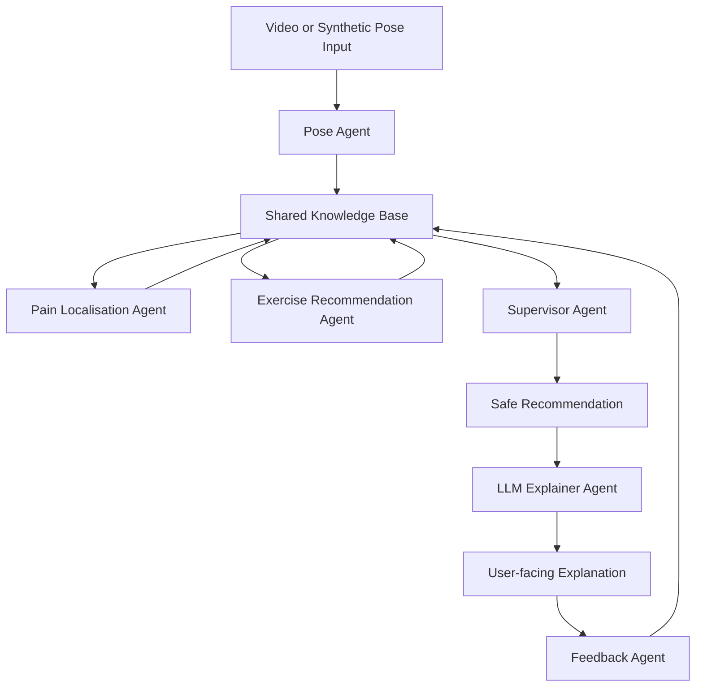
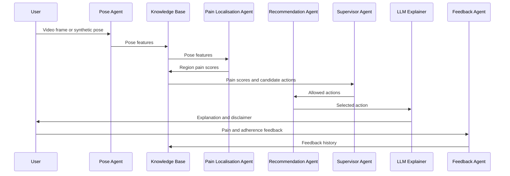
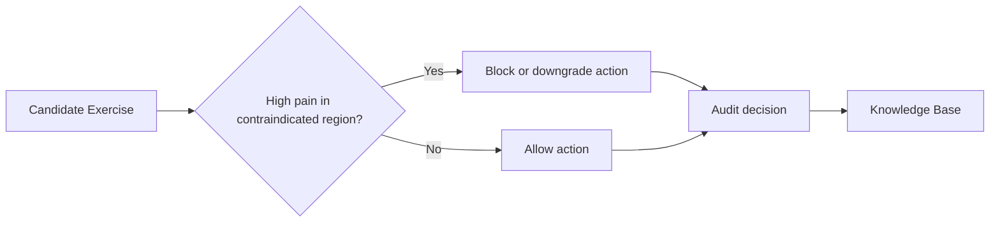

# Architecture

OpenRehabAgent follows a modular multi-agent architecture for video-based pain localisation and adaptive exercise recommendation.

## High-level architecture

## Sequence flow

## Safety governance

## Design principles

1. Modular agent boundaries
2. Transparent heuristics before complex models
3. Safety-aware recommendation
4. Feedback-based adaptation
5. Auditability and reproducibility
6. Clear non-clinical limitations
