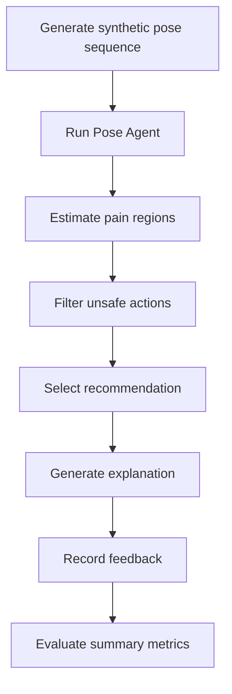

# Evaluation Plan

This document explains how OpenRehabAgent can be evaluated as a research prototype.

## Prototype evaluation metrics

| Area | Metric |
|---|---|
| Pose processing | successful pose feature extraction |
| Pain localisation | region-level score consistency |
| Recommendation | selected action per state |
| Safety | blocked or allowed action count |
| Feedback | pain score and completion rate |
| Explainability | generated explanation per recommendation |
| Auditability | logged events per session |

## Evaluation workflow

## Current evidence status

The repository demonstrates architectural feasibility and reproducible agent interaction. It does not claim clinical effectiveness.

## Future validation plan

1. compare recommendation policy against baseline rules
2. test pose adapter with open benchmark videos
3. add clinician-reviewed constraints
4. measure unsafe recommendation rate
5. evaluate explanation clarity
6. publish release notes and reproducibility instructions
